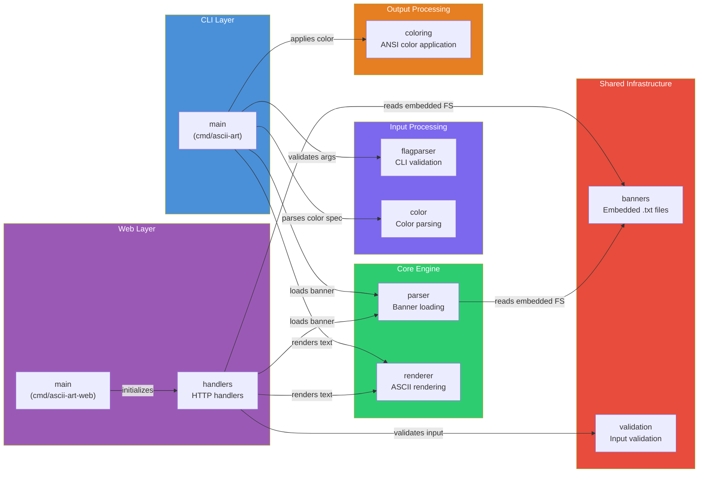

# Architecture Overview

High-level view of the system architecture. Packages are grouped by responsibility layer.

## Package Responsibilities

| Layer | Package | Responsibility |
|-------|---------|---------------|
| CLI | `main` (cmd/ascii-art) | Orchestrates CLI packages, handles I/O and exit codes |
| Web | `main` (cmd/ascii-art-web) | Initializes template cache, registers routes, starts HTTP server |
| Web | `handlers` | HTTP handlers, ASCII generation, template rendering |
| Shared | `banners` | Banner `.txt` files embedded into binary at compile time |
| Shared | `validation` | Validates web form input (text length, banner name) |
| Input | `flagparser` | Validates CLI argument structure |
| Input | `color` | Parses color specs (named, hex, RGB) into RGB values |
| Core | `parser` | Reads banner files from `fs.FS`, builds character maps |
| Core | `renderer` | Converts text to ASCII art using banner maps |
| Output | `coloring` | Applies ANSI color codes to rendered ASCII art |

## Key Design Decisions

- **Shared core engine** — both CLI and web server use the same `parser` and `renderer` packages
- **Embedded banners** — `internal/banners` embeds `.txt` files at compile time; both binaries are self-contained
- **No import cycles** — `handlers` imports `parser`, `renderer`, `validation`, `banners`; nothing imports back
- **Stateless packages** — all functions are pure transformations with no global state
- **Web input validation** — `validation` package is web-only; CLI uses `flagparser` and `bannerPaths` map
