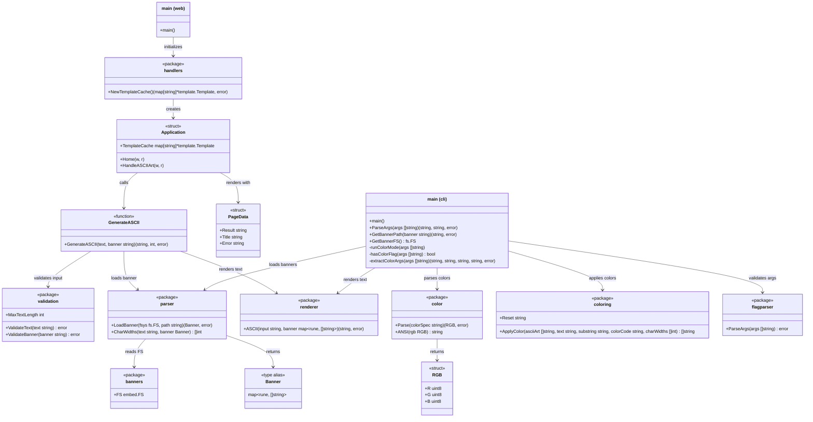

# Class Diagram

Package relationships, exported types, and function signatures.

## Dependency Rules

- Neither `parser`, `renderer`, `validation`, `coloring`, `color`, nor `flagparser` imports any other internal package
- `handlers` imports `parser`, `renderer`, `validation`, and `banners` — no cycles
- Both `main` packages are the only entry points that wire everything together
- All packages depend only on the Go standard library
