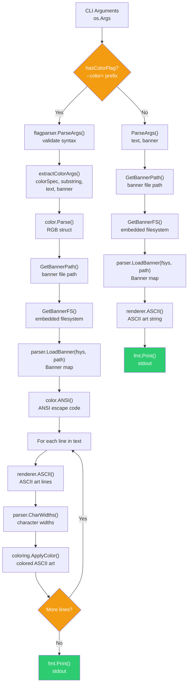
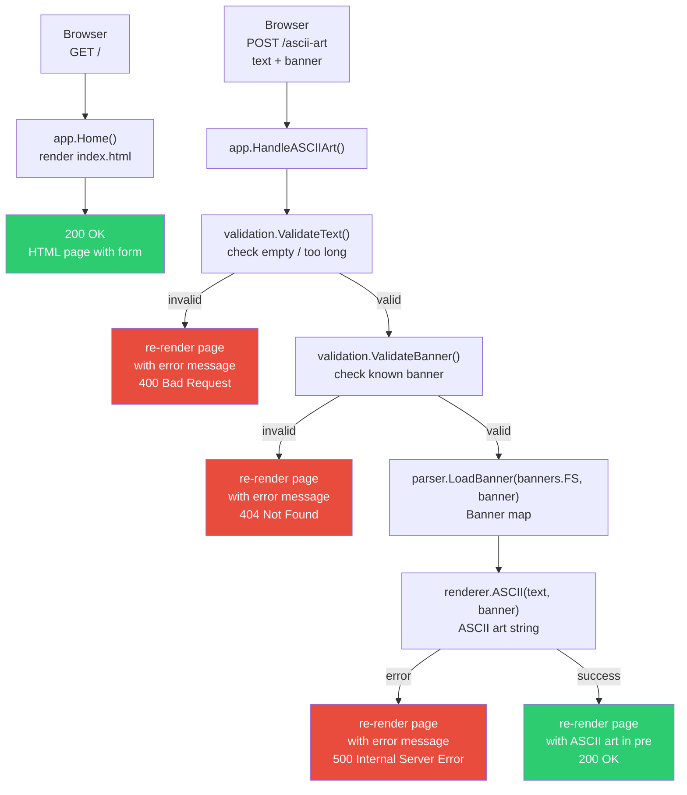

# Program Flowchart

Execution flows for both the **CLI** and **Web** interfaces.

## CLI Flow

The CLI has two modes: **Normal** (text only) and **Color** (with ANSI coloring).

## Web Flow

Browser request through the HTTP server to rendered response.

## Mode Comparison

| Aspect | CLI Normal | CLI Color | Web |
|--------|-----------|-----------|-----|
| Entry | `os.Args` | `os.Args` + `--color` | HTTP POST form |
| Validation | `ParseArgs()` | `flagparser.ParseArgs()` | `validation` package |
| Banner FS | `GetBannerFS()` (cmd embed) | `GetBannerFS()` (cmd embed) | `banners.FS` (internal embed) |
| Color | — | `color.Parse()` + `coloring.ApplyColor()` | — |
| Output | `fmt.Print()` stdout | `fmt.Print()` stdout | HTML template `<pre>` |
| Error handling | `os.Exit(code)` | `os.Exit(code)` | HTTP status + inline message |
