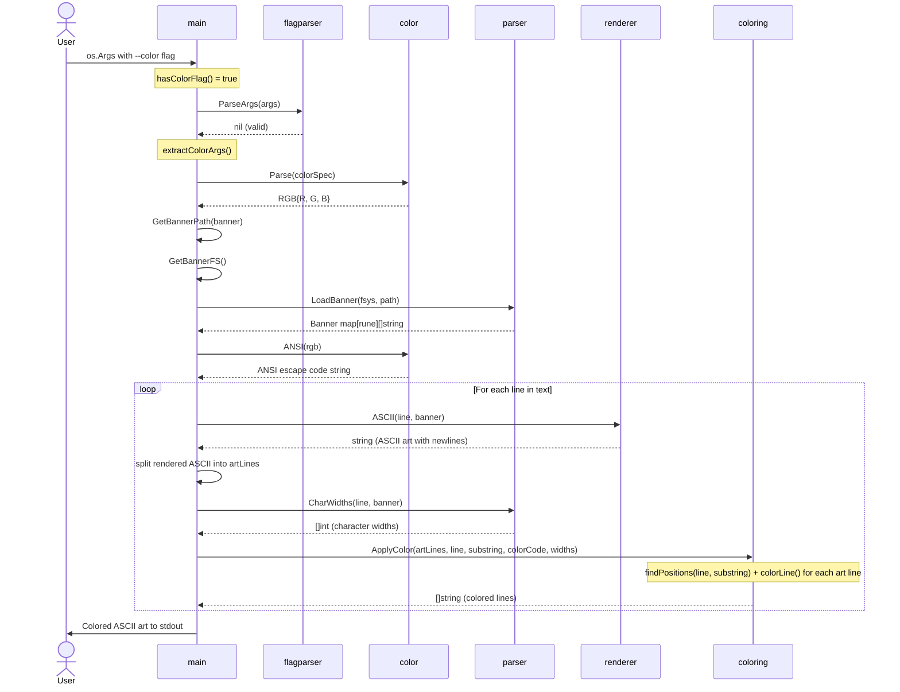
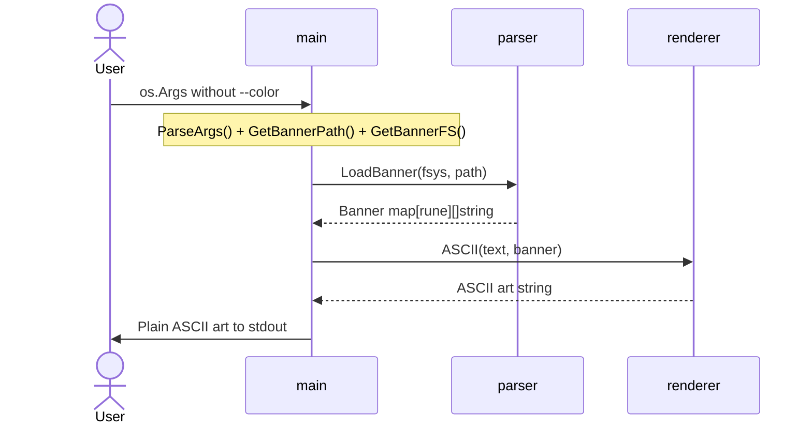
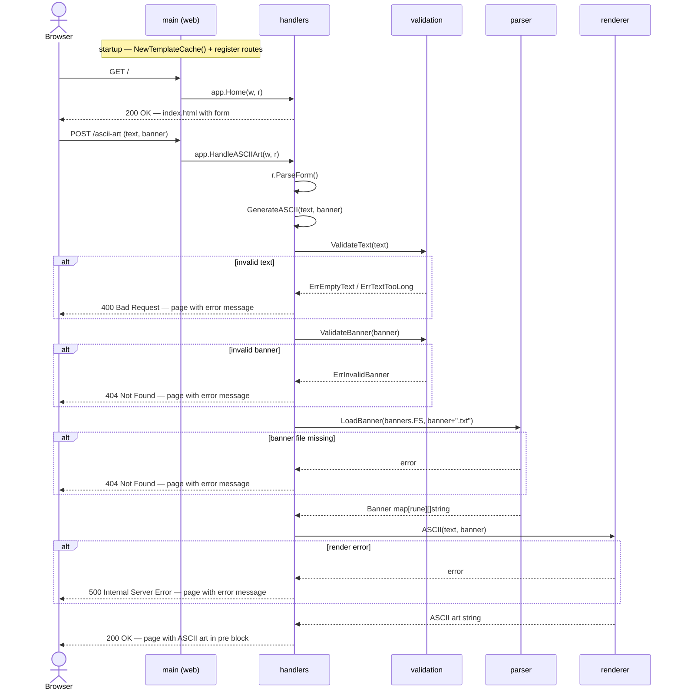

# Sequence Diagram

## CLI — Color Mode

Call sequence for **color mode** — the more complex CLI execution path. Shows how `main` orchestrates all packages over time.

## CLI — Normal Mode

For comparison, normal mode has a much shorter sequence:

## Web — HTTP Request/Response

Call sequence for a browser form submission through the web server.

